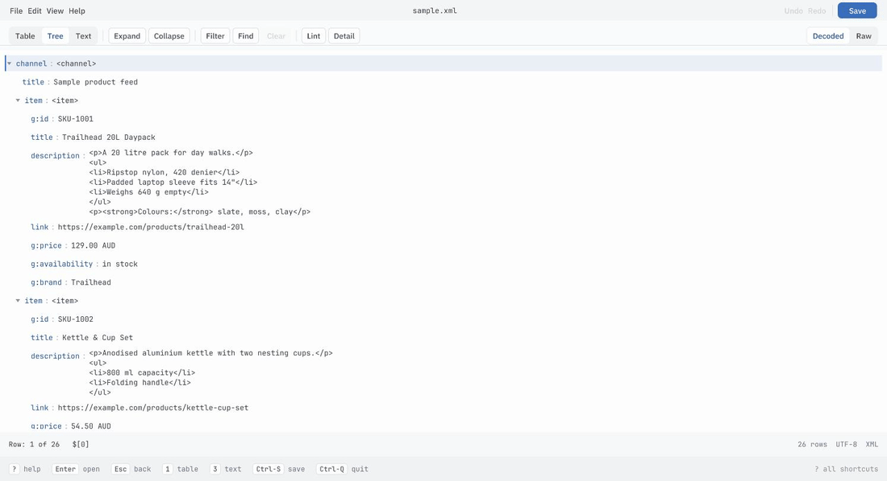

# vuwr

A fast, editable viewer for CSV, JSON and XML. One static binary, a
terminal UI, a native window and a browser build — all over the same core.

It exists because opening a CSV meant launching LibreOffice, which is slow
and silently mangles data on the way through, and checking a JSON or XML
file meant a text editor plus `jq` or `xmllint`.

## What it does

- Opens CSV, TSV, JSON and XML, in a terminal or a window
- **Edits** cells, JSON values, XML attributes and element text, with
  undo/redo
- **Never coerces your data.** CSV values stay strings: `007` stays `007`,
  `1.50` does not become `1.5`, and dates are never reinterpreted. JSON
  keeps its real types, and editing a number leaves it a number.
- **Saves without reformatting.** Key order, indentation, quoting style,
  line endings, XML comments and attribute order all survive, so editing
  one cell gives you a one-line `git diff`.
- Search, filter, marks, frozen columns
- Validates: `vuwr --check` replaces `jq empty` and `xmllint --noout`, and
  covers CSV too. It also reports what a parser lets through — a trailing
  comma (which vuwr itself reads, so the file can be opened and fixed) and
  duplicate JSON keys. `--strict` makes warnings fail too.
- A **lint** button in the window, and `:lint` in the terminal. Asked for
  rather than run as you type: the scan re-reads the whole document, which
  is 150 ms on a 15 MB file — a hitch after every edit, paid whether or
  not anybody was looking.


## See it

The terminal UI on a sheet — moving, resizing a column, sorting,
filtering, editing a cell in place:


The same binary on XML: the tree, the table it makes of a feed, and the
text view with the value under the cursor marked out:


The window build — the identical core and views, compiled to WebAssembly
and running in a browser tab:



Try it without installing anything: **[the hosted build](https://mageaustralia.github.io/vuwr/?sample)**
(`?sample=csv` and `?sample=json` open the other two). Files are read in
the tab; nothing is uploaded.

## Install

```sh
cargo build --release      # target/release/vuwr
```

## Use

```sh
vuwr data.csv              # terminal UI
vuwr --gui data.json       # native window
cat data.csv | vuwr        # reads stdin
vuwr data.csv | head       # piped output writes the document through

vuwr --check *.json        # exit 0 valid, 1 invalid, 2 unreadable
vuwr --licenses            # notices for the bundled fonts
```

Press `?` for the keys. The bar along the bottom lists the ones that
matter in the current view.

| | |
|---|---|
| `h j k l` / arrows | move |
| `Space` / `b` | page down / up |
| `1` `2` `3` | table / tree / text view |
| `i` / `c` | edit / replace the cell |
| `u` / `Ctrl-R` | undo / redo |
| `/` `n` `N` | search, next, previous |
| `&` / `r` | filter rows / clear the filter |
| `m` `M` `Ctrl-E` | mark, clear marks, print marked rows and exit |
| `f` | freeze columns left of the cursor |
| `<` `>` `=` | narrow, widen, re-fit the column (or drag its edge) |
| `:lint` | check for problems a parser lets through |
| `:w` `:q` `:wq` | write, quit, write and quit |

## Sample files

`examples/` holds one of each format — a product feed, a stock sheet and a
config file — so there is something to open on a fresh clone:

```sh
vuwr examples/products.xml
vuwr --gui examples/stock.csv
```

## In the browser

See [`web/README.md`](web/README.md). The same core and GUI compiled to
WebAssembly; files are read in the tab and nothing is uploaded. Every push
to `main` deploys it to GitHub Pages.

## Using the core as a library

`vuwr-core` is the whole application minus the drawing, and it is usable
on its own. It performs no I/O — bytes in, bytes out — has one dependency
(`regex`), forbids `unsafe`, and is checked against
`wasm32-unknown-unknown` on every push, so it runs anywhere Rust does.

```rust
use vuwr_core::{Document, FormatHint};

let mut doc = Document::parse(bytes, FormatHint::Auto)?;
doc.set_cell(0, 2, "42")?;          // undoable
let out = doc.serialize();           // untouched bytes stay byte-identical
```

Also worth taking on their own: `highlight()` for syntax spans,
`scan_json()` for lint diagnostics, `natural_cmp`/`sort_rows`, and
`decode`/`encode` for XML entities. `Session` + `Command` + `Effect` is
the frontend-agnostic application itself — the TUI is a 132-line wrapper
around it.

## Layout

```
crates/vuwr-core/   documents, edit ops, undo, session — no I/O, wasm-clean
crates/vuwr-tui/    ratatui frontend
crates/vuwr-gui/    egui frontend (native + web)
crates/vuwr-cli/    the binary
crates/vuwr-web/    the browser entry point
```

`vuwr-core` decides all behaviour; the frontends only map input and draw.
That is deliberate: it is what lets the same views run in a terminal, a
window and a browser tab, and what keeps the two frontends from drifting
apart in behaviour.

## Licence

MIT OR Apache-2.0.

egui bundles fonts under the SIL Open Font License and the Ubuntu Font
Licence, which require their notices to travel with the software. They are
embedded in the binary: `vuwr --licenses`, or Help → Acknowledgements in
the GUI.
